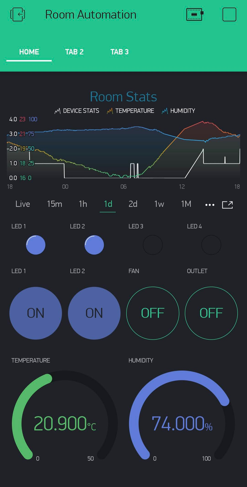

    

# Room Automation w/ Blynk

DIY room appliances control over the cloud ☁

## Project

To view the full details, visit 👉 [hackster.io](https://www.hackster.io/TasnimZotder/room-automation-w-blynk-e2d944)

## Components

- Node MCU (ESP8266) 12E
- Mini Breadboard
- 5V Relay Module (Min. 4 Channel)
- Wire
- 220V to 5V adapter w/ micro USB cable

## Tools & Services

- Arduino IDE
- VS Code (recomended)
- Blynk App (Android/iOS)
- Wifi Connection

## Resources

- [Breadboard Diagram](/resources/project_bb.pdf)
- [Schematic Diagram](/resources/project_schem.pdf)
- [PCB Diagram](/resources/project_pcb.pdf)

## 📝 License

This project is licensed under the [MIT License](/LICENSE)
